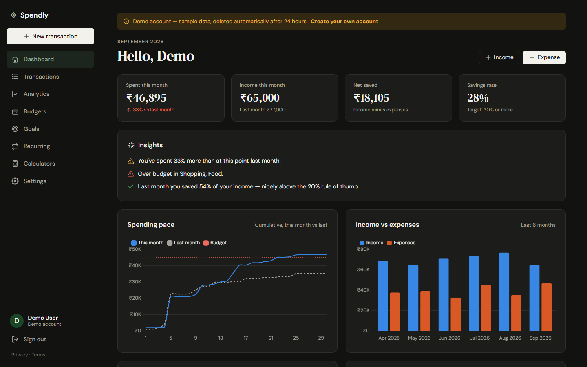
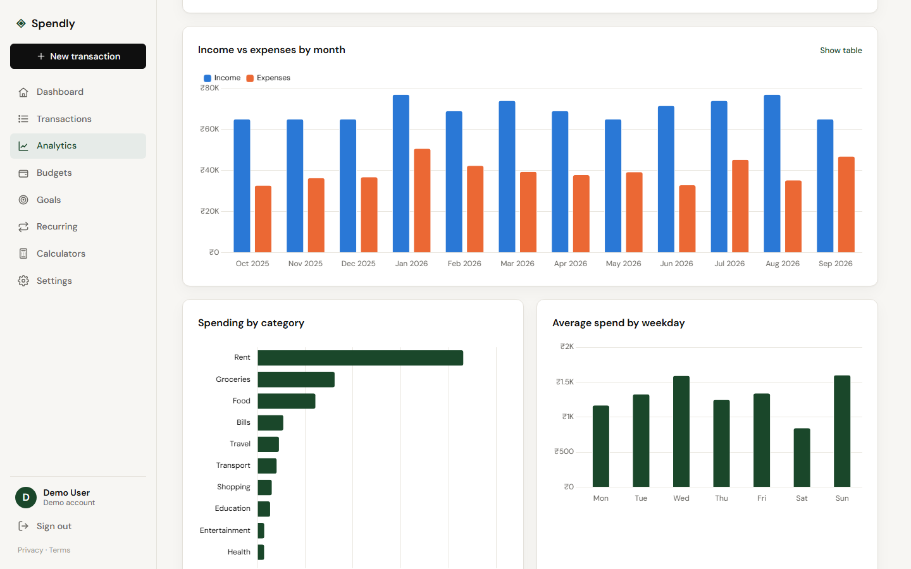
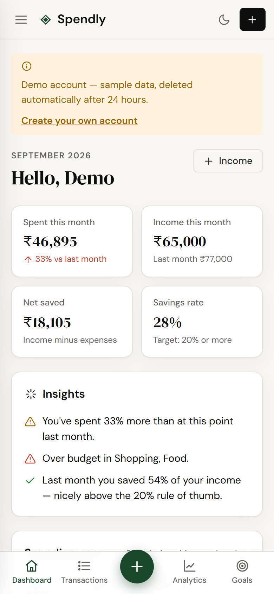
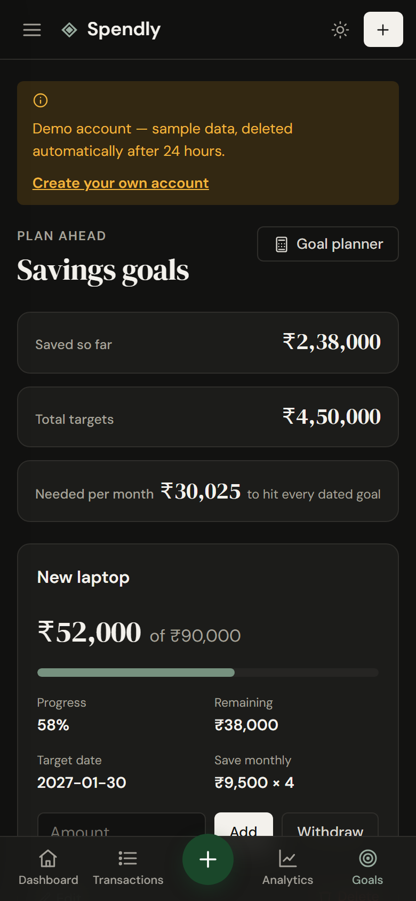
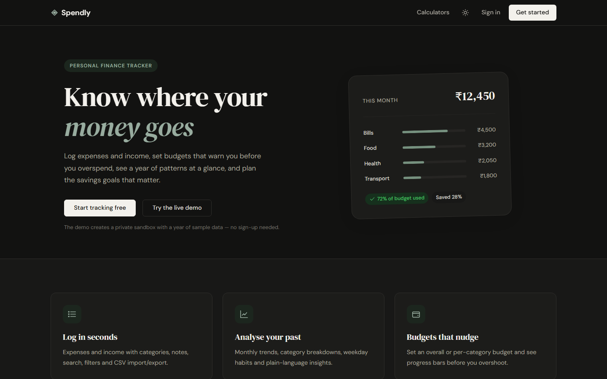

# ◈ Spendly — Personal Finance Tracker

Track every rupee. Spendly is a full-stack personal finance app for logging expenses and income,
setting budgets, analysing past spending, planning savings goals and running "what if" calculations —
with editable themes, dark mode and a mobile-first layout.


| Dashboard (dark) | Analytics (light) |
|---|---|
|  |  |

| Mobile dashboard | Mobile goals | Landing |
|---|---|---|
|  |  |  |

> **Try it without signing up:** click **“Try the live demo”** on the landing page. It creates a private
> sandbox account with a year of realistic sample data (auto-deleted after 24 hours).

---

## Features

**Accounts**
- Sign up / sign in, “keep me signed in”, one-click demo sandbox
- **Email verification** with a reminder banner and resend (rate-limited)
- **Forgot password** — single-use reset link by email, expires in 1 hour
- Change email (re-verified) and password; changing or resetting a password signs out every other device
- Export everything (CSV/JSON) or delete the account and all its data
- Privacy policy and terms of use pages

**Tracking**
- Expenses **and** income with categories, dates and notes; add / edit / delete
- Search, filter (type, category, date range), sort and paginate your history
- **CSV import** (validated, all-or-nothing) and **CSV / JSON export** (full backup)
- **Recurring transactions** — rent, salary, subscriptions are logged automatically (weekly / monthly / yearly,
  month-end safe: a rule on the 31st lands on Feb 28 and returns to the 31st in March)

**Understanding**
- **Dashboard:** month-to-date spend, income, net saved, savings rate, spending-pace chart vs last month,
  6-month income/expense trend, category breakdown, budget progress, recent activity
- **Analytics** for 3 / 6 / 12 months, year-to-date, all time or a custom range: monthly trend,
  category ranking, average spend by weekday, category × month heat table, largest expenses, income sources
- **Plain-language insights** — e.g. *“You've spent 12% less than at this point last month”*,
  *“At this pace you'll spend about ₹48,500 this month — ₹3,500 over budget”*,
  *“Food spending in Aug was up 31% versus the previous three-month average”*

**Planning**
- **Budgets:** an overall monthly limit plus per-category limits, with good / close / over states
- **Savings goals:** target, deadline, progress, add/withdraw money, and the monthly amount needed to hit each date
- **Calculators:** compound savings growth (with chart), goal planner, time-to-goal, emergency fund
  (pre-filled from your real 3-month average) and loan EMI

**Experience**
- **Editable themes:** 5 presets (Forest, Ocean, Plum, Terracotta, Graphite), light / dark / system mode,
  and a custom accent colour picker with live preview — saved per user
- **Mobile-first:** off-canvas sidebar, bottom tab bar with a floating “+” button, 16px inputs (no iOS zoom),
  safe-area aware, no horizontal scrolling at 390px
- Multi-currency display (₹ INR with Indian digit grouping `1,23,456`, रू NPR, $, €, £, A$, C$)
- Installable (web manifest), accessible (skip link, labelled controls, focus rings, `aria-live` flashes,
  chart ↔ table toggle, reduced-motion support), printable

## Security

| Concern | How it's handled |
|---|---|
| Passwords | Hashed with Werkzeug scrypt; min 8 chars with a letter and a number |
| Brute force | Login throttling per IP and per email (5 failures / 15 min); constant-time check for unknown emails |
| Account recovery | Signed, expiring reset links (itsdangerous) bound to the current password hash, so each works once; “forgot password” never reveals whether an email is registered; reset/verify emails rate-limited per address and IP |
| Stolen sessions | Sessions carry a password fingerprint — a password change or reset signs out all other devices |
| CSRF | Per-session token required on every POST (forms and `fetch`) |
| Session | `HttpOnly`, `SameSite=Lax`, `Secure` in production, regenerated on login (no fixation) |
| XSS | Jinja auto-escaping; strict **Content-Security-Policy** (`script-src 'self'`, no inline JS, Chart.js vendored) |
| SQL injection | Parameterised queries only; sort keys whitelisted; `LIKE` wildcards escaped |
| Authorisation | Every record lookup is scoped to the signed-in user (`404` for others' data) |
| Open redirect | `?next=` only accepts same-site relative paths |
| CSV injection | Exported cells starting with `= + - @` are neutralised |
| Headers | `X-Frame-Options: DENY`, `nosniff`, `Referrer-Policy`, `Permissions-Policy`, HSTS in production, `no-store` on private pages |
| Input limits | 2 MB uploads, 5,000 import rows, bounded amounts/dates/text lengths |
| Data loss | Automatic daily SQLite snapshots (online backup API, atomic write, 14 kept) + `flask backup-db` |

## Tech stack

- **Backend:** Python 3.12, Flask 3 (application factory + blueprints), SQLite (foreign keys, cascading deletes, indexes)
- **Frontend:** server-rendered Jinja templates, hand-written CSS with design tokens, vanilla JS, Chart.js 4
- **Testing:** pytest — 150 tests, ~96% coverage (SMTP tested against a fake server), GitHub Actions CI
- **Deploy:** Gunicorn; configs for Render and PythonAnywhere

Money is stored as **integer paise/cents** so totals never suffer floating-point drift.

## Project structure

```
app.py                 # application factory: config, security hooks, blueprints, error pages
config.py              # settings (env-driven), secret-key handling
wsgi.py                # production entry point (gunicorn wsgi:app)
database/db.py         # schema, connection handling, demo seed data, CLI commands
routes/                # blueprints: auth, main (dashboard, calculators), transactions,
                       #             budgets, goals, recurring, analytics, settings
services/              # framework-free logic: analytics & insights, finance maths,
                       #   money parsing/formatting, dates, recurring engine, security,
                       #   mailer (SMTP/console), signed tokens, backups
templates/             # Jinja templates (+ _macros.html component library)
static/                # css/style.css, js/{main,charts,calculators,theme-init}.js, vendor/chart.js
tests/                 # pytest suite
```

## Run locally

```bash
git clone https://github.com/NIRMALKANDEL/Spendly.git
cd Spendly
python -m venv venv
# Windows: venv\Scripts\activate    macOS/Linux: source venv/bin/activate
pip install -r requirements-dev.txt
python app.py                      # http://127.0.0.1:5001
```

Optional: `flask --app app seed-db` creates `demo@spendly.app` / `demo1234` with a year of data.

Locally, emails (verification, password reset) are **printed in the terminal** instead of being sent —
copy the link from there. Set the `MAIL_*` variables below to send real email.

Run the tests:

```bash
pytest --cov=.
```

### Configuration

| Variable | Default | Purpose |
|---|---|---|
| `SECRET_KEY` | generated into `instance/secret_key` | Session signing key — **required** when `PRODUCTION=1` |
| `DATABASE_PATH` | `instance/spendly.db` | SQLite file location |
| `PRODUCTION` | off | Enables secure cookies, HSTS and proxy header handling |
| `MAIL_SERVER` / `MAIL_PORT` | unset / `587` | SMTP server, e.g. `smtp.gmail.com` / `587`. Unset = print emails to the log (dev) or disable email features (production) |
| `MAIL_USERNAME` / `MAIL_PASSWORD` | unset | SMTP login. For Gmail use your address and a 16-character **app password** |
| `MAIL_FROM` | `MAIL_USERNAME` | Sender, e.g. `Spendly <you@gmail.com>` |
| `CONTACT_EMAIL` | unset | Shown on the privacy/terms pages |
| `BACKUP_DIR` / `BACKUP_KEEP` | `instance/backups` / `14` | Where daily snapshots go and how many to keep |
| `AUTO_BACKUP` | on | Take a snapshot automatically on the first request each day |

## Deploy

### Option A — PythonAnywhere (free, data persists) ✅ recommended

1. Sign up at [pythonanywhere.com](https://www.pythonanywhere.com) (free “Beginner” account).
2. Open a **Bash console** and run:
   ```bash
   git clone https://github.com/NIRMALKANDEL/Spendly.git
   cd Spendly
   python3.12 -m venv venv && source venv/bin/activate
   pip install -r requirements.txt
   python -c "import secrets; print(secrets.token_hex(32))"   # copy this value
   ```
3. **Web** tab → *Add a new web app* → *Manual configuration* → *Python 3.12*.
4. Set **Virtualenv** to `/home/<you>/Spendly/venv` and **Source code** to `/home/<you>/Spendly`.
5. Create a **Gmail app password** for sending emails: Google Account → Security → turn on 2-Step Verification →
   *App passwords* → create one named “Spendly” and copy the 16 characters. (Free PythonAnywhere accounts can send
   mail through Gmail's SMTP server.)
6. Edit the **WSGI configuration file** (Web tab) so it contains only the following. This file is private to your
   PythonAnywhere account — never commit these values to GitHub:
   ```python
   import os, sys
   path = "/home/<you>/Spendly"
   if path not in sys.path:
       sys.path.insert(0, path)
   os.environ["PRODUCTION"] = "1"
   os.environ["SECRET_KEY"] = "<paste the value from step 2>"
   os.environ["DATABASE_PATH"] = "/home/<you>/Spendly/instance/spendly.db"
   os.environ["MAIL_SERVER"] = "smtp.gmail.com"
   os.environ["MAIL_PORT"] = "587"
   os.environ["MAIL_USERNAME"] = "<you>@gmail.com"
   os.environ["MAIL_PASSWORD"] = "<the 16-character app password>"
   os.environ["MAIL_FROM"] = "Spendly <<you>@gmail.com>"
   os.environ["CONTACT_EMAIL"] = "<you>@gmail.com"
   from wsgi import app as application
   ```
7. **Static files:** URL `/static/` → Directory `/home/<you>/Spendly/static`.
8. Turn on **Force HTTPS**, click **Reload**. Your app is live at `https://<you>.pythonanywhere.com`.
9. **Backups:** the app already snapshots the database once a day into `~/Spendly/instance/backups/` (last 14 kept).
   For a guaranteed daily run, add a **Tasks** → scheduled task (free accounts get one):
   `cd /home/<you>/Spendly && venv/bin/flask --app app backup-db`.
   Every few weeks, download the newest file from the **Files** tab to keep a copy off the server.

To update later: `cd ~/Spendly && git pull && source venv/bin/activate && pip install -r requirements.txt`,
then **Reload** on the Web tab. Database changes are migrated automatically on start.

**Restoring a backup:** on the Web tab click *Disable*, then in a console
`cp ~/Spendly/instance/backups/spendly-YYYY-MM-DD.db ~/Spendly/instance/spendly.db`, then *Enable* / *Reload*.

### Option B — Render (one-click from GitHub)

1. Sign in to [render.com](https://render.com) with GitHub → **New → Blueprint** → pick this repo.
2. Render reads `render.yaml`, generates a `SECRET_KEY` and deploys to `https://spendly-xxxx.onrender.com`.

Render's free plan has **no persistent disk**, so the database resets on each redeploy and the app sleeps
after 15 minutes idle (first visit then takes ~30s). That's fine for a portfolio demo — the “Try the live demo”
button always works — but use PythonAnywhere (or add a Render disk) for real personal data.

## Roadmap ideas

- PostgreSQL support for multi-instance hosting
- Receipt photo attachments
- Email reminders for budgets and recurring bills
- Split expenses with friends
- Offline mode with a service worker

## License

MIT — see [LICENSE](LICENSE).
